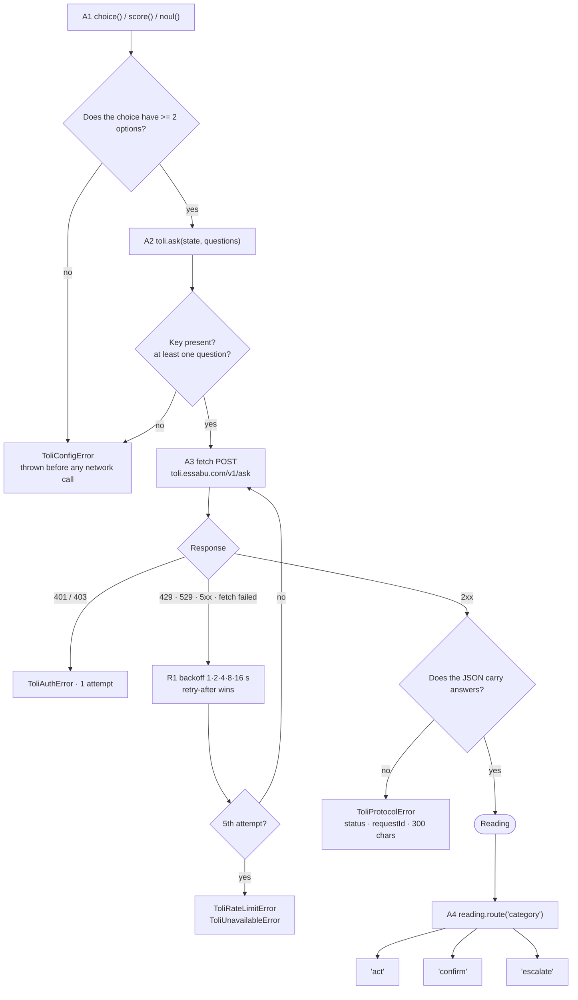

# Toli for TypeScript

[](https://www.npmjs.com/package/@essabu/toli)

Typed decisions with a calibrated confidence, and the three-route rule that
keeps a human in the loop.

```bash
npm i @essabu/toli
```

Node 18+ (or any environment with `fetch`: Bun, Deno, Workers, the browser —
but **never with the key in the browser**). No runtime dependencies; ESM and
CJS, types included.

---

## In one screen

```ts
import { Toli, choice, noul, score, Thresholds } from '@essabu/toli'

const toli = new Toli({
  apiKey: process.env.TOLI_API_KEY!,
  thresholds: Thresholds.measured(
    0.85,
    0.6,
    '896 support tickets, French',
    '2026-09-18',
  ),
  model: 'toli-1',
})

const reading = await toli.ask(
  // Send what is needed to judge — and nothing more. A name or a phone number
  // has no bearing on a category and no business leaving your infrastructure.
  { interface: ticket.interface, feature: ticket.feature, description: ticket.description },
  {
    category: choice('Which team should handle this ticket', {
      application: 'The application misbehaves',
      hardware: 'A device is broken or missing',
      synchronization: 'Data does not sync',
      other: 'None of the above',
    }),
    urgent: noul('The sender is blocked from working today'),
    tone: score('How frustrated the sender appears', [
      'Calm',
      'Frustrated but civil',
      'Angry, strong language',
    ]),
  },
)

switch (reading.route('category')) {
  case 'act':
    await ticket.assignTo(reading.value('category') as string)
    break
  case 'confirm':
    await ticket.suggest(reading.value('category') as string)
    break
  case 'escalate':
    await ticket.queueForTriage()
    break
}

if (reading.answer('urgent').isYes && reading.route('urgent') === 'act') {
  await ticket.raisePriority()
}

logger.info(reading.toLog())   // model, routes, thresholds, probabilities
```

All three questions travel in **one** request. Asking them separately would
cost three times as much and take three times as long, for the same answers.

> Write question instructions in English: the model is trained on English
> first. Measure before writing them in another language.

---

## What happens when you call `ask()`



`ToliConfigError` does **not** extend `ToliError`: a caller catching Toli
errors in order to retry must not silently swallow its own configuration bugs.

---

## Domains where acting alone is not an option

```ts
// Clinical orientation, screening: the 'act' route does not exist.
const thresholds = Thresholds.advisory(0.6, 'screening cohort, 2026', '2026-09-19')
```

No confidence, not even 0.999, returns `'act'` under this mode: at best
`'confirm'`, which a qualified person accepts or rejects. The `advisory` flag
travels in `toLog()`, so a reading can be shown afterwards never to have been
able to act alone.

---

## The API

| Export | What it does |
|---|---|
| `new Toli({ apiKey, thresholds?, model?, baseUrl?, fetch?, sleep? })` | The client; only change `baseUrl` for local development |
| `toli.ask(state, questions, model?)` | One call, every question, returns a `Reading` |
| `choice(instructions, criteria)` | Closed set; refuses fewer than two options |
| `score(instructions, criteria)` | Ordered levels, weakest to strongest |
| `noul(instructions)` | A statement; returns the probability of yes |
| `reading.route(name)` | `'act'` / `'confirm'` / `'escalate'` |
| `reading.value(name)` | The chosen option, the score, or the probability |
| `reading.answer(name)` | `certainty`, `probabilities`, `legend`, `isYes` |
| `reading.toLog()` | Model, thresholds, routes, distributions — never the state |
| `Thresholds.measured / advisory / defaults` | Thresholds: dated, or advisory |

There is deliberately no `decide()` and no `autoRoute()`. Toli proposes; your
code disposes.

---

## Errors

| Class | When | Retried for you |
|---|---|---|
| `ToliConfigError` | missing key, inconsistent thresholds, one-option `choice` | no — fix the call |
| `ToliAuthError` | 401 / 403 | no |
| `ToliRateLimitError` | 429, after five attempts | yes |
| `ToliUnavailableError` | 5xx, 529, `fetch failed` | yes |
| `ToliProtocolError` | non-JSON body, 200 without `answers`, other 4xx | no |

Each carries `status`, `requestId` and a `bodyExcerpt` capped at 300 characters
— enough to diagnose, too little to spill a state into a log file.

A dropped connection retries like a 429. That rule is not theoretical: three
readings out of 897 were lost before it existed.

---

## Where to run this package

The Toli key is a server secret. In a front-end application (Nuxt, Next,
TanStack Start), call Toli from a server route and never from the browser — a
published package cannot stop you, but saying it here prevents the most
ordinary leak there is.

---

## Development

```bash
npm ci
npm test         # Vitest, including the shared conformance suite
npm run typecheck
npm run build
```

The conformance tests read `../spec/conformance/*.json` — the same fixtures
every other Toli SDK replays.
